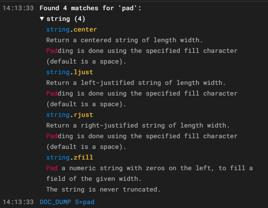
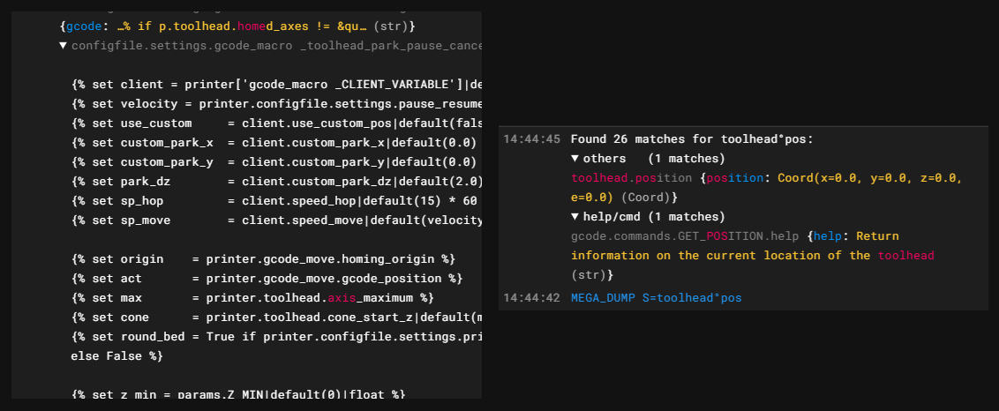
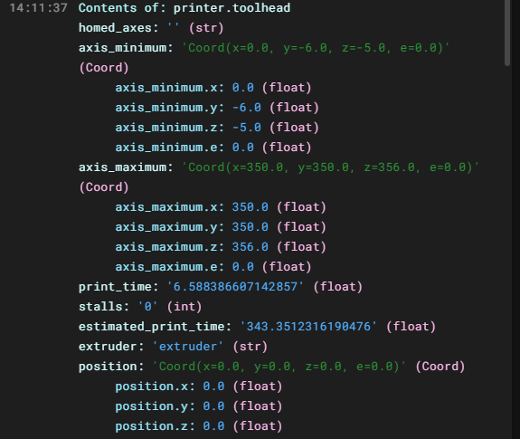
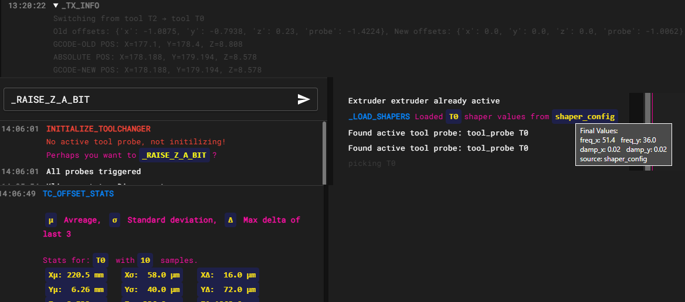
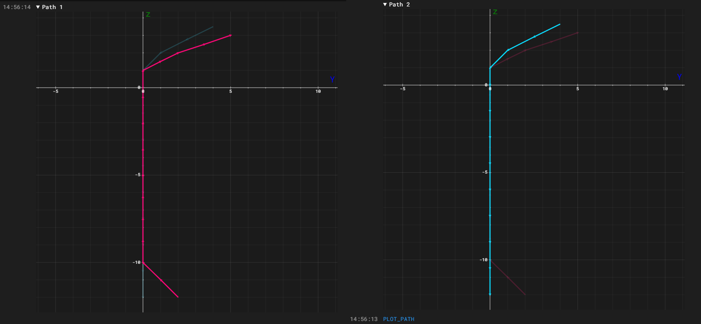

# Klipper-Toolchanger-Macros


## macro_debugging.cfg 

| Macro               | Description                                   | Example                          |
|---------------------|-----------------------------------------------|----------------------------------|
| **[DOC_DUMP](./macro_debugging.cfg#L7)**         | search the jinja function docs with keywords.                  |  |
| **[SEARCH](./macro_debugging.cfg#L100)**        | brute force search for finding what executes what, finding objects and their type.   |  |
| **[PRINT_PRINTER_PATH](./macro_debugging.cfg#L298)**| can print out specific paths, useful for debugging, easy to drop into macros to dump entire objects during runtime.|  |
| **[NINJAGO](./macro_debugging.cfg#L544)**| can evaluate jinja for testing|  |
---


| Macro               | Description                                   | Example                          |
|---------------------|-----------------------------------------------|----------------------------------|
| **[_UNIFIED_RESPOND](./_unified_respond.cfg#L3)** (_unified_respond.cfg) | Rich, color-coded status messages with formatting, tooltips, and multi-line support for detailed macro feedback. easily formattable, supporting foldable summaries, hover text, and even clickable commands.  |  |

---

# toolchanger specific stuff
| Macro               | Description                                   | Example                          |
|---------------------|-----------------------------------------------|----------------------------------|
| **[PLOT_PATH](./plot_path.cfg#L3)** (plot_path.cfg) | a macro to generate SVGs to help you understand the docking path, provide with PATH or none to show the path from your toolchanger configs. |  |


## tc_offset_calibration_extras.cfg
edit 
```
variable_edge_offset: 15
variable_grid_count: 3
```
Run ```TC_ENDSTOP_AND_NUDGE_ACCURACY``` to start running a test for the nudge std deviation and endstop deviation.
doesnt really need changing of anything, default will grab 3x3 so 9 probes and get the std deviations of them.

since there is no native option to stop the console spam from the toolchanger plugin i can HIGHLY recommend adding this into your mainsaiils interface (console) settings.

```^Probe made contact at [-+]?\d+\.\d+,\s*[-+]?\d+\.\d+,\s*[-+]?\d+\.\d+$``` 
as a regex filter

